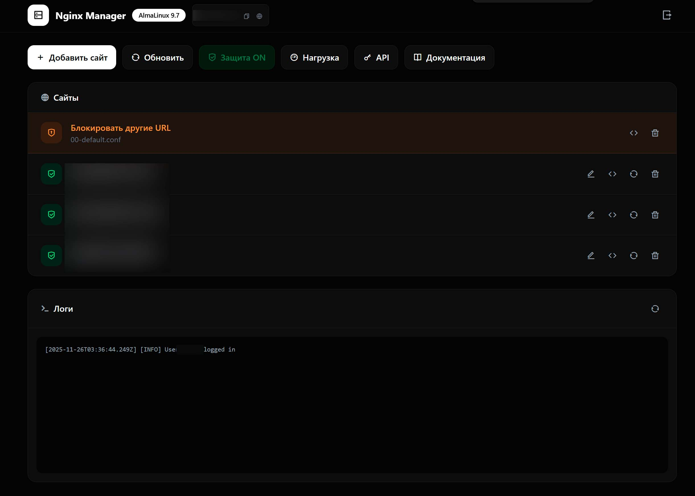

# Nginx Proxy Manager (Node.js)



Удобный и быстрый менеджер для проксирования доменов через **Nginx**, написанный на **Node.js**.
Инструмент позволяет легко управлять доменными прокси, сертификатами, конфигурацией сервера и нагрузкой в реальном времени.

---

## 🚀 Возможности

### 🔹 Проксирование доменов

* Быстрое создание прокси на **IP** или **Domain**
* Поддержка **WebSocket**
* Гибкие настройки проксирования для любых задач

### 🔹 Работа с SSL-сертификатами

* Автоматическая генерация **Let's Encrypt** сертификатов
* Поддержка **самоподписанных** сертификатов
* Возможность использовать **свой собственный** сертификат

### 🔹 Управление Nginx

* Редактор **Nginx-конфига** прямо в веб-интерфейсе
* Перезагрузка / проверка конфига
* Просмотр логов (опционально)

### 🔹 Системная информация

* Отображение **нагрузки на сервер в реальном времени**
* Получение всех **IPv4** адресов сервера

### 🔹 API

* Генерация ключей API
* API для **добавления / удаления / получения** списка прокси-доменов
* Возможность интеграции с внешними панелями, ботами, автоматизацией

### 🔹 Конфигурация проекта

* Все настройки удобно вынесены в **.env**
* Поддержка переменных окружения и кастомных параметров

---

## 📦 Требования

Перед запуском убедитесь, что на сервере установлены:

* **Nginx**
* **CertBot**
* **Node.js (LTS)**

---

## ⚙️ Установка и запуск

### 1. Клонируйте репозиторий

```bash
git clone https://github.com/Gidroponik/nginx_proxy_manager.git
cd nginx_proxy_manager
```

### 2. Установите зависимости

```bash
npm install
```

### 3. Создайте файл `.env`

В корне создайте:

```
.env
```

И заполните по примеру:

```
.env.example
```

### 4. Запустите менеджер

```bash
npm run start
```

---

## 🔑 API

Подробное описание запросов находится в конфиге .env:

```
API_DOCS_PATH=
```

API ключи создаются в веб-панели и используются для запросов:

* Добавление домена
* Удаление домена
* Получение списка прокси

---

## 🖥 Веб-интерфейс

* Современная UI-панель
* Удобное управление доменами
* Редактор Nginx
* Отображение нагрузки CPU/RAM/NET в реальном времени
* Генерация SSL-сертификатов одной кнопкой

---

## ⭐ Поддержка

Если проект оказался полезным — поставьте ⭐ звезду в репозитории.
Это помогает развитию проекта и появлению новых функций.
